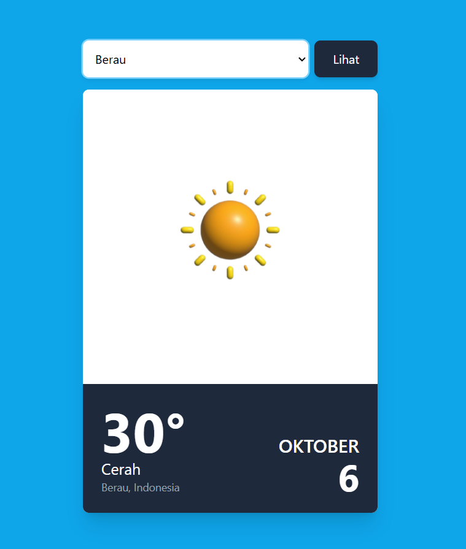

# 📝 Tugas Pertemuan 4 Aplikasi Cuaca Menggunakan JavaScript

Mata Kuliah Pemrograman Web 
Sebuah aplikasi web dinamis yang dibangun sebagai proyek untuk mata kuliah Pemrograman Web. Aplikasi ini menampilkan data cuaca secara real-time dengan memanfaatkan JavaScript untuk mengambil data dari API dan memanipulasinya di sisi klien. Proyek ini menunjukkan kemampuan dalam pengembangan antarmuka yang fungsional dan responsif.

# 📝 Aplikasi Cuaca Preview
